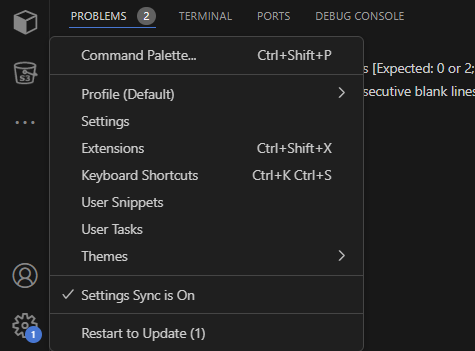
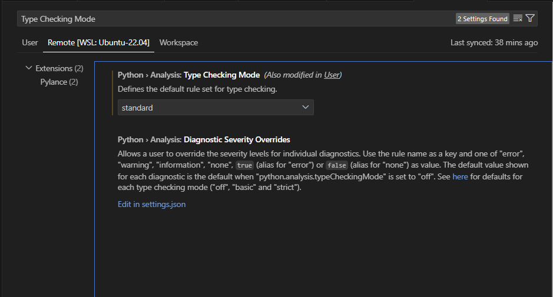

# Python Conference 2024 - Type Driven Development: Enhancing Code Readability in Python Communities with Type Annotations

## Why are Type Annotations Important in Code Writing?

Clarity is a virtue when it comes to writing code. Imagine writing a code today and coming back after two months only to struggle to understand the same code you wrote. Guido van Rossum, the founder of the Python programming language, gave an analagy of this concept on a discussion with Lex Fridman. Computers are dumb and somehow they need instructions. Imagine you have a cook book  manufactured by a cook and people buy the cook book and try to create a the recipe in the cook book, the goal of the cookbook author is to make it clear to the human amateur chef in most cases. When writing computer programs, you have two audience at once. The computer needs to understand what to do and also program has to be readable by other programmers. The complex program is already complex enough, we can make things seamless by using type annotations. The Python community does not have the culture of properly annotating code and I believe that for any community to thrive, there needs to be harmony and understanding.

The talk aims to get you familiar with Type annotations so that you can writr safe, clean, and reliable codes when you write programs.

## What are Type Annotations?

Type annotations are simply an hinting that gives you an idea of what a variable is. For example, you see someone putting on a lab coat and a stethoscope, the stethoscope gives you an idea that the person is a Doctor or at best a Scientist. This is same purpose that annotations serve.

## Data and Data Types

Data are core essence of every programming language. The Data types are used to identify the character or attribute of a data. The basic data types we have in Python are:

* **Integers**: The integers are basically used to represent whole numbers in the Python. e.g 7, 8, 135. The standard syntactical form for integers in Python is `int`.

* **Floats**: The floats type is used to represent decimal numbers. e.g. 3.5, 4.9, 1200.35.  The standard syntactical form for floats in Python is `float`.

* **String**: The string type is used to represent characters in Python. The standard syntactical form for strings in Python is `str`

* **Boolean**: The boolean type is used to represent output of a comparision expression in Python. They subtly have forms in other data types and are represented as `True` or `False`. The standard syntactical form for boolean is `bool`.

* **None**: The None type is used to represent empty or null objects in Python. The standard syntactical form for floats in Python is `None`.

## Python: A Dynamically Typed Language

Python is referred to as a dynamically typed language because the types are checked at runtime and not at compile time. This simply means that you can write and execute code without having to specify explicit types for variables or function return values. The variable type is determined based on the value assigned to it during the program's execution.

## Configure Type Checks on your Integrated Development Environment (IDE)

For this talk, I would be using Visual Studio Code. To configure type checks on visual studio code. Follow this simple steps:

1. Open the `Settings` tab at the left bottom corner of your screen and click on settings.



2. On the search bar, search for `Type Check Mode`, you will find the `Python > Analysis: Type Checking Mode` there. Set it to `standard`, it is always `off` by default.




## Setting up Virtual Environment
You can set up a virtual environment with the following command:
```
python -m venv types
```

Then enter the virtual environment with the following command:
```
source type/bin/activate
```

## Install static type checker mypy
```
pip install mypy
```

### Code Sample
To practise type annotation, you can annotate the code in this [link](https://github.com/Dolamu-TheDataGuy/Type-Annotations---Python-/blob/master/Basic_Types/type_test.py).

Then run the following command in the terminal to statically type check your code:
```
mypy <name of python file>
```

You can find the solutions [here](https://github.com/Dolamu-TheDataGuy/Type-Annotations---Python-/blob/master/Basic_Types/type_test_solution.py).

You can find the slide to the talk [here](https://www.canva.com/design/DAGHPvvyEO8/9p5OqO5p2SyjxUeXgYRl4g/edit?utm_content=DAGHPvvyEO8&utm_campaign=designshare&utm_medium=link2&utm_source=sharebutton)